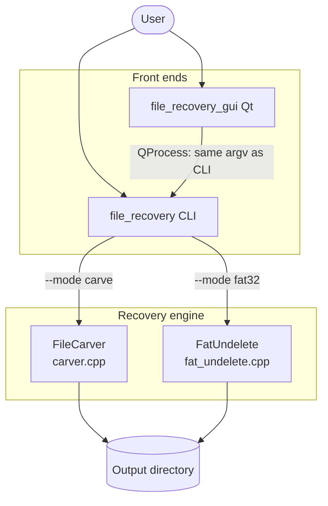
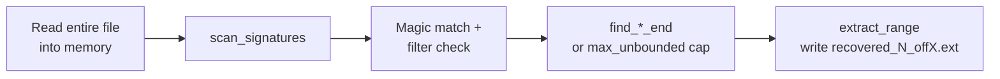
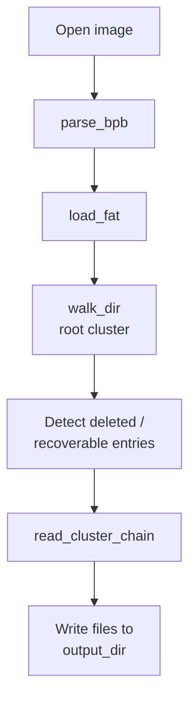

[](https://github.com/sanjayaharshana/file-recovery/actions/workflows/release.yml)

# file-recovery

CLI and optional **Qt 6** GUI tools to recover data from disk images and files:

- **Carve** — scan a file or walk a folder and extract files by content signatures (JPEG, PNG, PDF, ZIP, GIF).
- **FAT32 undelete** — recover deleted entries from a FAT32 volume image (e.g. USB/SD dump).

The GUI launches the **`file_recovery`** CLI next to itself (`QProcess`); release builds keep both binaries in the same folder.

---

## How it works

### Carve mode (file carving)

Carving is **filesystem-agnostic**: the tool reads the input as a **flat byte stream** (one file) or walks a **folder tree** and runs the same logic on every regular file. It looks for **known file signatures** (magic bytes) at each offset—for example JPEG (`FF D8 FF`), PNG (`89 50 4E 47 …`), PDF (`%PDF`), ZIP local headers, and GIF headers.

When a signature matches and passes the optional **`--types`** filter, the code estimates where that embedded file **ends** (format-specific: JPEG scans for `FF D9`, PNG parses chunks to `IEND`, etc.). For formats where the end is ambiguous or expensive to detect (PDF, ZIP, GIF), recovery is **capped** by **`--max-chunk`** so a runaway scan cannot read gigabytes as one object.

Each recovered blob is written under **`--output`** with a generated name like `recovered_1_off12345.jpg` (index + start offset + extension). This mode is useful for **damaged volumes, slack space, memory dumps, or whole-disk images** where normal directory listing is not reliable.

### FAT32 undelete mode

Here the input must be a **single binary image** of a **FAT32** volume (partition dump or whole device, depending on what you captured). The tool:

1. Reads the **boot sector / BPB** and checks it looks like **FAT32** (e.g. root entry count zero, FAT32 label).
2. Loads the **File Allocation Table** into memory (28-bit cluster chains).
3. **Walks the directory tree** starting at the root cluster, including long file names (LFN) where present.
4. Finds entries that represent **deleted files** (classic first byte `0xE5` on short names) and, in some cases, files under a **deleted directory** (so children are still recovered even if their own dirents were not marked deleted).

For each candidate, it follows the **cluster chain** from the FAT, reads raw clusters, and writes a sanitized filename into **`--output`**. This mode needs a **consistent FAT**; if clusters were overwritten after deletion, data may be partial or wrong.

### GUI vs CLI

The **GUI does not reimplement recovery**. It collects paths and options, then starts **`file_recovery`** with the same **`--mode` / `--input` / `--output`** (and carve-only flags) and shows **stdout/stderr** in a log view. The CLI must live **next to** the GUI executable (CMake copies it there on build; release bundles do the same).

---

## Architecture (diagrams)

Overall flow:



Carve pipeline (single file):



FAT32 undelete pipeline:



---

## Source code overview

| Path | Responsibility |
|------|----------------|
| [`main.cpp`](main.cpp) | **Program entry**: parses `--mode`, `--input`, `--output`, `--types`, `--max-chunk`. Dispatches to **`FileCarver`** or **`FatUndelete`**. In **carve** mode with a **directory** `--input`, recursively walks files (skipping some system/metadata folders) and runs **`FileCarver`** per file, mirroring relative paths under `--output`. |
| [`carver.hpp`](carver.hpp) / [`carver.cpp`](carver.cpp) | **`FileCarver`**: reads one input file into a buffer, **`scan_signatures`** linear scan, per-format **end detection** (`find_jpeg_end`, `find_png_end`, `find_pdf_end`, `find_zip_end_bounded`, `find_gif_end`), **`extract_range`** writes slices. **`CarveOptions`** holds paths, type filter, and max chunk size. |
| [`fat_undelete.hpp`](fat_undelete.hpp) / [`fat_undelete.cpp`](fat_undelete.cpp) | **`FatUndelete`**: **`parse_bpb`**, **`load_fat`**, **`next_cluster`**, **`cluster_byte_offset`**, **`read_cluster_chain`**, directory reading, **`walk_dir`** for deleted-file logic and LFN handling, **`sanitize_filename`** for safe output names. |
| [`CMakeLists.txt`](CMakeLists.txt) | Builds **`file_recovery`**. If **Qt6::Widgets** is found, builds **`file_recovery_gui`** and **POST_BUILD** copies the CLI next to the GUI binary (Windows/macOS bundle layout). |
| [`gui/main.cpp`](gui/main.cpp) | Qt app entry: **`QApplication`**, shows **`MainWindow`**. |
| [`gui/mainwindow.h`](gui/mainwindow.h) / [`gui/mainwindow.cpp`](gui/mainwindow.cpp) | Form fields for mode, paths, carve options; **`onRun`** builds argument list and **`QProcess`**; log via **`readyReadStandardOutput`**. **`recoveryExecutablePath()`** resolves **`file_recovery`** / **`file_recovery.exe`** beside the app. |
| [`gui/app_style.hpp`](gui/app_style.hpp) / [`gui/app_style.cpp`](gui/app_style.cpp) | Application stylesheet / visual styling. |
| [`packaging/`](packaging/) | Linux **`.desktop`** and icon used by **linuxdeploy** in CI (not required for local CLI-only builds). |

Namespace **`recovery`** in the headers groups carve and FAT logic away from `main`.

---

## Requirements (build from source)

| Component | Notes |
|-----------|--------|
| **CMake** | 4.1 or newer ([CMake download](https://cmake.org/download/)) |
| **C++ compiler** | C++20 (Clang, GCC, or MSVC) |
| **Qt 6** (optional) | Qt Widgets, for `file_recovery_gui`. If Qt is not found, only the CLI is built. |

---

## Compile from source

Always configure in a **fresh build directory** (do not commit or reuse `build/` from another machine).

### All platforms (outline)

```bash
cmake -S . -B build -DCMAKE_BUILD_TYPE=Release
cmake --build build
```

- **CLI:** `build/file_recovery` (macOS/Linux) or `build/file_recovery.exe` (Windows).
- **GUI:** same folder, plus `file_recovery_gui` / `.app` on macOS when Qt 6 is available.

Point CMake at Qt when it is not auto-detected:

```bash
cmake -S . -B build -DCMAKE_BUILD_TYPE=Release -DCMAKE_PREFIX_PATH=/path/to/Qt/6.x.y/<arch>
cmake --build build
```

### Windows

1. Install **Visual Studio 2022** (Desktop development with C++) or **Build Tools for Visual Studio** with the MSVC x64 toolchain.
2. Install **CMake** and **Ninja** (optional but recommended), or use the Visual Studio generator.
3. Install **Qt 6** (e.g. MSVC 2022 64-bit kit from the [Qt installer](https://www.qt.io/download-open-source) or [aqtinstall](https://github.com/miurahr/aqtinstall)).
4. Open **“x64 Native Tools Command Prompt for VS 2022”** (or run CMake from an environment where `cl.exe` is on `PATH`).
5. Configure and build, for example:

```bat
cmake -S . -B build -G Ninja -DCMAKE_BUILD_TYPE=Release -DCMAKE_PREFIX_PATH=C:\Qt\6.8.3\msvc2022_64
cmake --build build
```

Outputs: `build\file_recovery.exe`, and if Qt was found, `build\file_recovery_gui.exe` with the CLI copied beside it.

### macOS

1. Install **Xcode** or **Command Line Tools** (`xcode-select --install`).
2. Install **CMake** (e.g. `brew install cmake`).
3. Install **Qt 6** (e.g. `brew install qt@6`), then pass its prefix to CMake, for example:

```bash
cmake -S . -B build -DCMAKE_BUILD_TYPE=Release -DCMAKE_PREFIX_PATH="$(brew --prefix qt@6)"
cmake --build build
```

Run the GUI: `open build/file_recovery_gui.app` (the CLI is inside `Contents/MacOS/` next to the GUI binary).

### Linux

Install a compiler and Qt 6 development packages, then build. Example on Debian/Ubuntu:

```bash
sudo apt update
sudo apt install -y build-essential cmake ninja-build qt6-base-dev
cmake -S . -B build -G Ninja -DCMAKE_BUILD_TYPE=Release
cmake --build build
```

On other distributions, install the packages that provide **Qt6 Widgets** and **CMake**, then use the same `cmake` commands (set `CMAKE_PREFIX_PATH` if Qt is in a custom location).

---

## Install from prebuilt releases

GitHub **Actions** builds tagged releases (`v*`) and attaches archives per OS (see the repository **Releases** page).

### Windows

1. Download **`file-recovery-<version>-windows-x64.zip`**.
2. Extract the folder anywhere you like.
3. Run **`file_recovery_gui.exe`** or **`file_recovery.exe`** from that folder.

The release is packaged with **`windeployqt`** using **`--no-compiler-runtime`**. If the GUI fails to start, install the **Microsoft Visual C++ Redistributable** for VS 2022 (x64) from [Microsoft’s VC++ downloads](https://learn.microsoft.com/en-us/cpp/windows/latest-supported-vc-redist).

### macOS

1. Download **`file-recovery-<version>-macos-arm64.zip`** (built for **Apple Silicon**).
2. Unzip and open **`file_recovery_gui.app`**, or run the CLI from **`file_recovery_gui.app/Contents/MacOS/file_recovery`**.

If Gatekeeper blocks the app, use **System Settings → Privacy & Security** to allow it, or right-click the app and choose **Open** once.

### Linux

1. Download **`file-recovery-<version>-linux-x64.tar.gz`**.
2. The archive is an **AppDir** layout (`usr/bin`, `usr/lib`, …). Extract into a new directory, then run:

```bash
mkdir -p file-recovery && tar -xzf file-recovery-<version>-linux-x64.tar.gz -C file-recovery
./file-recovery/usr/bin/file_recovery --help
./file-recovery/usr/bin/file_recovery_gui
```

The archive is an **AppDir-style** layout (Qt libraries bundled under `usr/`). You can move the extracted tree anywhere; keep `usr/` intact so the GUI finds Qt plugins and the CLI.

---

## Command-line usage

```text
file_recovery --mode <carve|fat32> --input <path> --output <dir> [options]
```

- **`--mode carve`** — signature recovery from a file, or recursively under a directory (`--input` as folder).
- **`--mode fat32`** — undelete from a **single FAT32 image file** (`--input` must not be a directory).

Carve options:

- **`--types`** — comma-separated: `jpeg`, `png`, `pdf`, `zip`, `gif` (default: all).
- **`--max-chunk`** — max bytes for formats without a reliable end (default: 52428800).

Examples:

```bash
./file_recovery --mode carve --input ./disk.img --output ./recovered
./file_recovery --mode carve --input ./folder --output ./out --types jpeg,png
./file_recovery --mode fat32 --input ./usb_fat32.img --output ./undeleted
```

Use **`--help`** for the short usage text.
